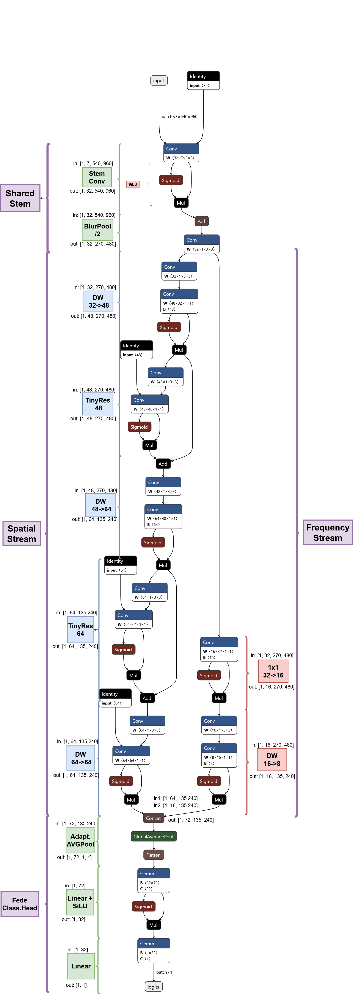

## FedeNet — Dual‑Stream CNN for Spatial × Frequency Cues

> **A tiny, efficient CNN that fuses spatial features with fixed frequency maps to make robust binary decisions.**

---

## Introduction
FedeNet is a compact convolutional neural network designed to exploit **two complementary sources of visual evidence**: (1) standard spatial features extracted from RGB images, and (2) **engineered frequency maps** (Sobel, Laplacian, high‑pass, local variance) that correlate strongly with image sharpness/blur and micro‑texture cues. The model uses a **shared anti‑aliased stem** and then processes signals in **two lightweight streams** before a late fusion head aggregates evidence for a binary decision.

Although small (≈23k params, ~2.13 GFLOPs at 540×960), FedeNet aims for **high accuracy and interpretability** by explicitly separating spatial and frequency information flows, letting each specialize and then **cooperate** in the classifier head.

---

## Objective
This repository explores a **flip vs. not‑flip** detection challenge and a closely related **blur vs. not‑blur** decision. During data exploration we observed that the flip/not‑flip labels showed a strong dependency on **image sharpness**, which motivated a model that can **leverage blur‑related frequency cues** while preserving spatial detail for the final decision.

---

## Inspiration
We first experimented with standard transfer‑learning baselines: **ResNet‑18 (11.7M params, 18.7 GFLOPs)**, **MobileNetV2 (3.5M params, 3.1 GFLOPs)** and **EfficientNet‑B0 (5.3M params, 4.03 GFLOPs)**. After fine‑tuning, these models achieved **Precision ≈ 0.99** and **Recall ≈ 0.997** on our dataset. The EDA, however, revealed a notable correlation between the target labels (flip vs. not‑flip) and **image blur measured via Laplacian variance**. This led us to design **FedeNet**, a much **smaller** network that explicitly taps into this clue via frequency maps, seeking comparable accuracy with **far fewer parameters**.

---

## Application
**Binary classification:** *blurry* vs. *not blurry* (or, more generally, “quality/consistency” cues) while **conserving spatial details** for the decision. The same design transfers naturally to related binary judgments where **texture/edge statistics** are informative.

---

## Architecture (exact summary)
> The following table is the exact architecture summary of **FedeNet‑Tiny** at input size **540×960** with **7 input channels (RGB + 4 frequency maps)**.

```
==========================================================================================================================================================================
Layer (type:depth-idx)                        Input Shape               Output Shape              Param #                   Kernel Shape              Mult-Adds
==========================================================================================================================================================================
FedeNetTiny                                   [1, 7, 540, 960]          [1, 1]                    --                        --                        --
├─StemAA: 1-1                                 [1, 7, 540, 960]          [1, 32, 270, 480]         --                        --                        --
│    └─Conv2d: 2-1                            [1, 7, 540, 960]          [1, 32, 540, 960]         2,016                     [3, 3]                    1,045,094,400
│    └─BatchNorm2d: 2-2                       [1, 32, 540, 960]         [1, 32, 540, 960]         64                        --                        64
│    └─SiLU: 2-3                              [1, 32, 540, 960]         [1, 32, 540, 960]         --                        --                        --
│    └─BlurPool2d: 2-4                        [1, 32, 540, 960]         [1, 32, 270, 480]         --                        --                        --
├─SpatialStream: 1-2                          [1, 32, 270, 480]         [1, 64, 135, 240]         --                        --                        --
│    └─Sequential: 2-5                        [1, 32, 270, 480]         [1, 64, 135, 240]         --                        --                        --
│    │    └─DWConvBlock: 3-1                  [1, 32, 270, 480]         [1, 48, 270, 480]         1,920                     --                        236,390,496
│    │    └─TinyResidual: 3-2                 [1, 48, 270, 480]         [1, 48, 270, 480]         2,832                     --                        354,585,696
│    │    └─DWConvBlock: 3-3                  [1, 48, 270, 480]         [1, 64, 135, 240]         3,632                     --                        113,529,728
│    │    └─TinyResidual: 3-4                 [1, 64, 135, 240]         [1, 64, 135, 240]         4,800                     --                        151,372,928
│    │    └─DWConvBlock: 3-5                  [1, 64, 135, 240]         [1, 64, 135, 240]         4,800                     --                        151,372,928
├─FrequencyStream: 1-3                        [1, 32, 270, 480]         [1, 8, 135, 240]          --                        --                        --
│    └─Conv2d: 2-6                            [1, 32, 270, 480]         [1, 16, 270, 480]         512                       [1, 1]                    66,355,200
│    └─BatchNorm2d: 2-7                       [1, 16, 270, 480]         [1, 16, 270, 480]         32                        --                        32
│    └─SiLU: 2-8                              [1, 16, 270, 480]         [1, 16, 270, 480]         --                        --                        --
│    └─DWConvBlock: 2-9                       [1, 16, 270, 480]         [1, 8, 135, 240]          --                        --                        --
│    │    └─Conv2d: 3-6                       [1, 16, 270, 480]         [1, 16, 135, 240]         144                       [3, 3]                    4,665,600
│    │    └─Conv2d: 3-7                       [1, 16, 135, 240]         [1, 8, 135, 240]          128                       [1, 1]                    4,147,200
│    │    └─BatchNorm2d: 3-8                  [1, 8, 135, 240]          [1, 8, 135, 240]          16                        --                        16
│    │    └─SiLU: 3-9                         [1, 8, 135, 240]          [1, 8, 135, 240]          --                        --                        --
├─FedeHead: 1-4                               [1, 64, 135, 240]         [1, 1]                    --                        --                        --
│    └─AdaptiveAvgPool2d: 2-10                [1, 72, 135, 240]         [1, 72, 1, 1]             --                        --                        --
│    └─Sequential: 2-11                       [1, 72]                   [1, 1]                    --                        --                        --
│    │    └─Linear: 3-10                      [1, 72]                   [1, 32]                   2,336                     --                        2,336
│    │    └─SiLU: 3-11                        [1, 32]                   [1, 32]                   --                        --                        --
│    │    └─Dropout: 3-12                     [1, 32]                   [1, 32]                   --                        --                        --
│    │    └─Linear: 3-13                      [1, 32]                   [1, 1]                    33                        --                        33
==========================================================================================================================================================================
Total params: 23,265
Trainable params: 23,265
Non-trainable params: 0
Total mult-adds (Units.GIGABYTES): 2.13
==========================================================================================================================================================================
Input size (MB): 14.52
Forward/backward pass size (MB): 734.05
Params size (MB): 0.09
Estimated Total Size (MB): 748.66
==========================================================================================================================================================================
```

---

## Architecture diagram
Below is the Netron‑generated plot of the ONNX export, annotated with stream boundaries and tensor shapes.




**Reading tips (ONNX):**
- **SiLU** appears as `Sigmoid → Mul` with both ops fed by the same tensor (`x * sigmoid(x)`).
- **BlurPool /2** is a grouped depthwise `Conv` with a smooth binomial kernel and `stride=2` following a `Pad`.
- **Depthwise‑separable blocks** show as `Conv (groups=in_ch)` then `Conv (1×1)` + BN + SiLU.
- **Residuals** end with an `Add` op that merges the sub‑block output with its input.
- **Fusion** happens via a single `Concat` (axis=1) before global average pooling.

> The model takes **7 channels** (RGB + 4 frequency maps), halves the resolution once in the stem (anti‑aliased),
> downsamples each stream once more, concatenates (**64 + 8 = 72** channels at H/4×W/4), applies GAP and a tiny MLP, and outputs **one logit**.

---

## How FedeNet works — two streams that cooperate, not compete

**High‑level intent.** FedeNet follows a **dual‑stream philosophy**:

- **Spatial stream** learns from pixel‑level spatial patterns (edges, shapes, textures, structures, context).
- **Frequency stream** processes **hand‑crafted frequency‑enhanced channels** (Sobel, Laplacian, high‑pass, local variance).

So the model is given both the **raw spatial signal** and an **engineered frequency hint**. Early feature extraction stays independent (each stream processes its own modality separately). Only later (in the head) are they **fused**, after both streams have formed their own feature abstractions.

**How it learns to use them differently.** Even though both streams are convolutional, they see **different statistical distributions**:

| Stream | Input Distribution | Typical Filter Responses | Gradient Incentive |
|---|---|---|---|
| Spatial (RGB) | Natural images: smooth, correlated pixels | Oriented edges, blobs, color gradients | Preserve spatial structure and semantics |
| Frequency | Sobel, Laplacian, high‑pass, variance maps | Sparse, edge‑emphasized, noise‑sensitive | Extract stability or enhancement cues |

### Information flow
1) **Input formation.** Preprocess with `AppendFrequencyMaps`: compute grayscale‑based **Sobel magnitude**, **Laplacian**, **3×3 high‑pass**, and **local variance (√)**; robust‑normalize each to [0,1]; **append** to RGB → `(B, 7, H, W)`.
2) **Shared stem (anti‑aliased).** `Conv3×3+BN+SiLU` then **BlurPool /2** creates a clean base `(B,32,H/2,W/2)`.
3) **Spatial stream.** A small stack of depthwise‑separable blocks with one stride‑2 step → `(B,64,H/4,W/4)`; residuals preserve low‑freq consistency and context.
4) **Frequency stream.** A narrow 1×1 squeeze (32→16), one stride‑2 DW block (→8ch) → `(B,8,H/4,W/4)`; it learns a compact summary of high‑frequency evidence.
5) **Late fusion & head.** `Concat` → **Global Avg Pool** → **MLP (72→32→1)** → **binary logit**. The head learns when frequency evidence should dominate vs. spatial semantics.

---

## Pre‑ and post‑processing (recommended)
- **ResizePad** to 540×960 while preserving aspect ratio (pads only when needed).  
  *Note: this resolution corresponds to a 2× downsampling of Full HD (1080×1920) images.*
- **AppendFrequencyMaps** to add four grayscale-derived maps to the RGB channels.
- *(Optional)* **NormalizeRGBOnly**: standardize only the first three (RGB) channels and pass the additional frequency channels unchanged.
- **Loss / Activation**: use **BCEWithLogitsLoss** during training, and apply a **sigmoid** at inference if probability outputs are required.

---

## Hybrid initialization (optional)
You can copy the **RGB** part of a pretrained backbone’s first conv into FedeNet’s stem while randomly initializing the extra frequency channels:
- `efficientnet_b0` (perfect 32‑channel match), or
- `resnet18` (slice first 32 filters from the 64‑channel stem).

This warm‑starts RGB features while letting the network learn how to exploit the added frequency channels.

---

## Files
- `FedeNet.py` – full implementation (model + transforms + hybrid init helper)
- `sup-imgs/FedeNetTiny.arch.png` – Netron diagram used above
- `FedeNetTiny.onnx` (optional) – export for visualization

---

## Citation
If you use **FedeNet** in academic or industrial projects, please reference this repository as follows:

> **FedeNet: A Dual-Stream CNN for Spatial and Frequency Cues**  
> Developed by Federico Bessi, 2025.  
> GitHub: [https://github.com/FederCO23/FedeNet](https://github.com/FederCO23/FedeNet)  
>  
> ```bibtex
> @software{fedenet2025,
>   author       = {Federico Bessi},
>   title        = {FedeNet: A Dual-Stream CNN for Spatial and Frequency Cues},
>   year         = {2025},
>   publisher    = {GitHub},
>   journal      = {GitHub repository},
>   url          = {https://github.com/FederCO23/FedeNet},
>   note         = {Version 1.0, Apache License 2.0}
> }
> ```


---

## License
This project is released under the **Apache License 2.0**.

You are free to use, modify, and distribute this software under the terms of the Apache-2.0 license.  
Please refer to the [LICENSE](./LICENSE) file at the repository root for the full text.

> © 2025 Federico Bessi. Licensed under the Apache License, Version 2.0.


